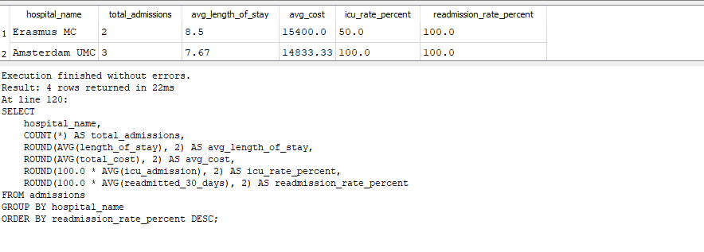
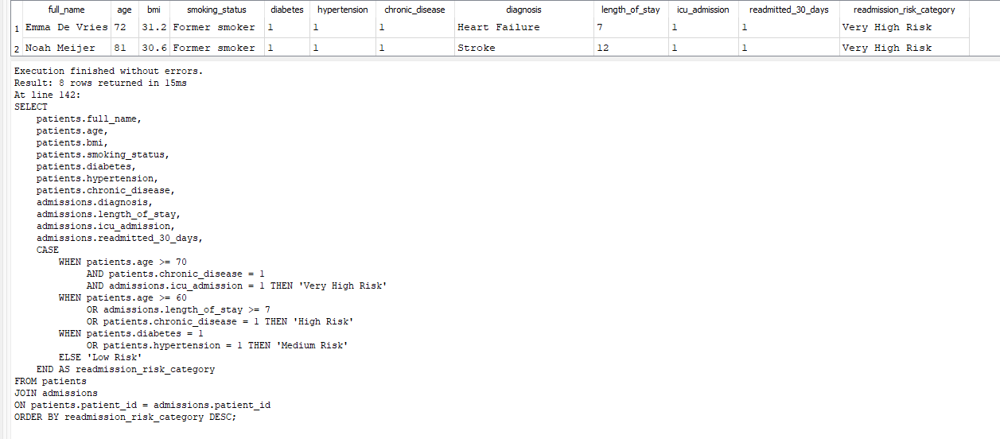
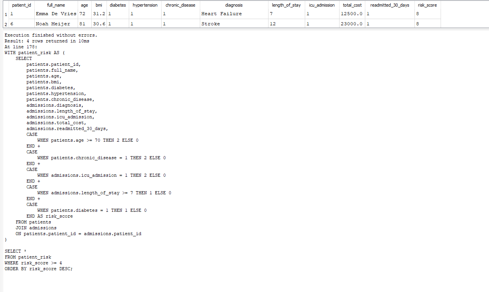
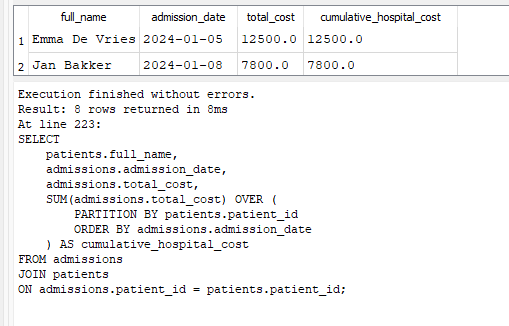
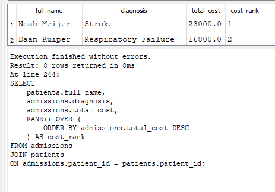

# Predicting Hospital Readmission Risk using SQL & Python

This project demonstrates healthcare analytics, SQL querying, and machine learning techniques for predicting 30-day hospital readmission risk using synthetic patient-level hospital data inspired by Dutch healthcare analytics workflows.

The repository combines:
- SQL healthcare analytics,
- risk segmentation,
- hospital KPI analysis,
- predictive modeling,
- machine learning,
- healthcare business intelligence.

---

# Project Overview

The project simulates a realistic hospital analytics environment with:
- patient demographic data,
- hospital admissions,
- ICU admissions,
- chronic disease indicators,
- medication usage,
- hospitalization costs,
- readmission outcomes.

The analysis focuses on identifying factors associated with increased readmission risk and healthcare resource utilization.

---

# Technologies Used

## SQL & Database
- SQLite
- DB Browser for SQLite

## Python & Machine Learning
- Python
- pandas
- scikit-learn
- matplotlib
- Google Colab

---

# SQL Skills Demonstrated

- JOINs
- GROUP BY
- CASE WHEN
- Common Table Expressions (CTEs)
- Window Functions
- Ranking Functions
- KPI Calculations
- Risk Segmentation
- Healthcare Analytics Queries

---

# Database Structure

## patients
Contains patient demographic and clinical risk data.

### Variables
- age
- BMI
- smoking status
- diabetes
- hypertension
- chronic disease indicators
- insurance type

---

## admissions
Contains hospital admission records.

### Variables
- admission date
- discharge date
- diagnosis
- ICU admission
- length of stay
- total hospitalization cost
- 30-day readmission flag

---

## medications
Contains medication and adverse event information.

### Variables
- drug name
- dosage
- adverse event indicator

---

# Healthcare Analytics Objectives

The primary objective of this project is to identify clinical and operational factors associated with hospital readmission risk.

The analysis focuses on:
- patient-level healthcare risk profiling,
- hospitalization cost analysis,
- ICU admission trends,
- chronic disease burden,
- predictive healthcare analytics,
- hospital performance KPIs.

The workflow simulates healthcare analytics processes commonly used in:
- hospitals,
- healthcare insurance,
- public health analytics,
- healthcare consulting,
- health informatics.

---

# SQL Analytics Performed

## Hospital KPI Analysis
- Readmission rate by hospital
- ICU admission rate
- Average hospitalization cost
- Average length of stay

## Clinical Risk Analysis
- High-risk patient identification
- Chronic disease risk profiling
- Readmission segmentation
- Cost-based patient ranking

## Advanced SQL Techniques
- Common Table Expressions (CTEs)
- Window Functions
- Ranking Functions
- Multi-table JOIN analysis
- CASE WHEN classification logic

---

# Python Machine Learning Analysis

This project also includes a machine learning workflow for predicting 30-day hospital readmission risk using Python and scikit-learn.

## ML Techniques
- Logistic Regression
- Feature Importance Analysis
- ROC Curve & AUC
- Predictive Risk Modeling

## Features Used
- Age
- BMI
- Diabetes
- Hypertension
- Chronic disease
- ICU admission
- Length of stay
- Hospitalization cost

---

# Machine Learning Workflow

## ML Pipeline
1. Data preprocessing
2. Exploratory data analysis (EDA)
3. Feature selection
4. Logistic regression modeling
5. Readmission probability prediction
6. ROC-AUC evaluation
7. Feature importance interpretation

## Business Value
The workflow demonstrates how healthcare institutions can:
- identify high-risk patients earlier,
- optimize hospital resource allocation,
- reduce preventable readmissions,
- improve patient outcome monitoring,
- support data-driven clinical decision making.

---

# Project Screenshots

## Hospital KPI Analysis


## Readmission Risk Segmentation


## High Risk Patient CTE Analysis


## Window Function Cost Analysis


## Patient Cost Ranking


---

# Repository Structure

```text
hospital-readmission-risk-sql-python/
│
├── database/
├── sql/
├── notebooks/
├── screenshots/
├── outputs/
└── README.md

---
# Repository Structure

```text
hospital-readmission-risk-sql-python/
│
├── database/
├── sql/
├── notebooks/
├── screenshots/
├── outputs/
└── README.md
```

---

# Future Improvements

Potential future extensions of this project include:

- Random Forest and XGBoost models
- SHAP explainability analysis
- Power BI healthcare dashboards
- Time-series hospital occupancy forecasting
- Integration with real-world healthcare open datasets

---

# Author

Agata Gabara

Bioinformatics | Healthcare Analytics | SQL | Python | Machine Learning | Risk Analytics
